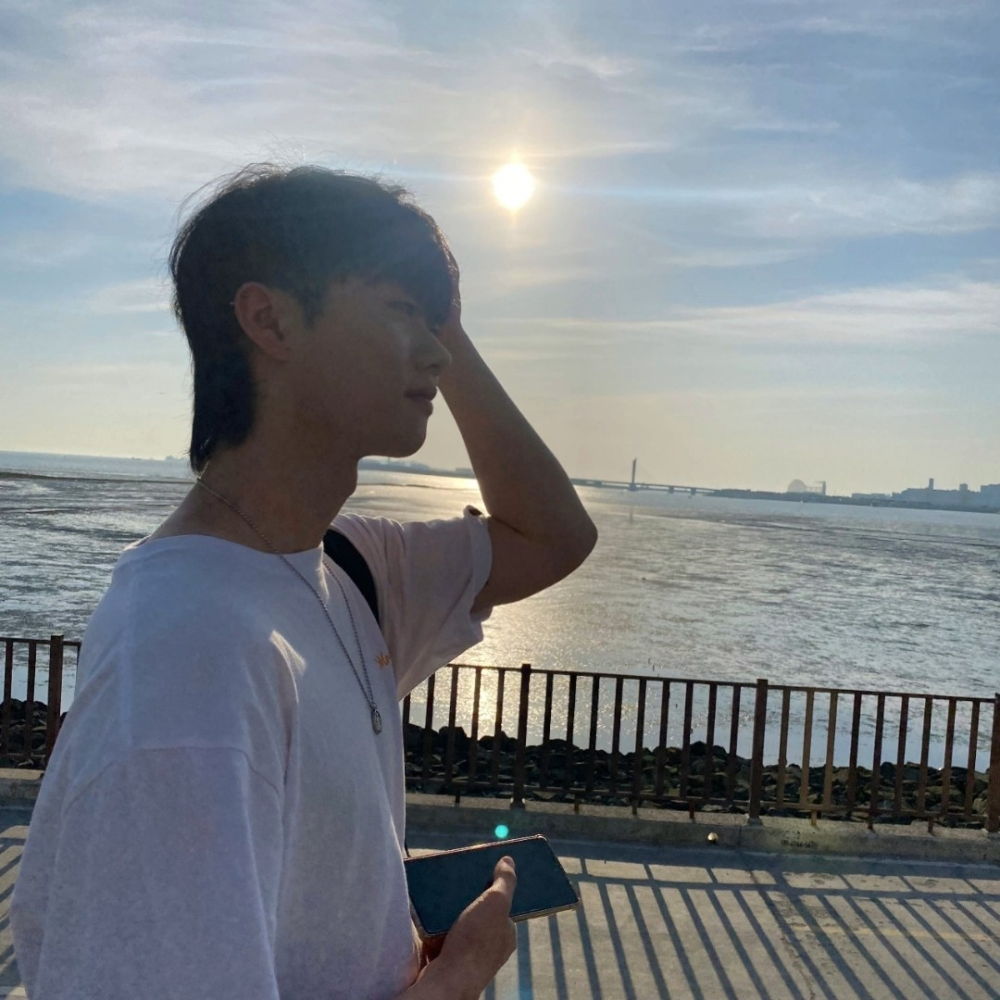
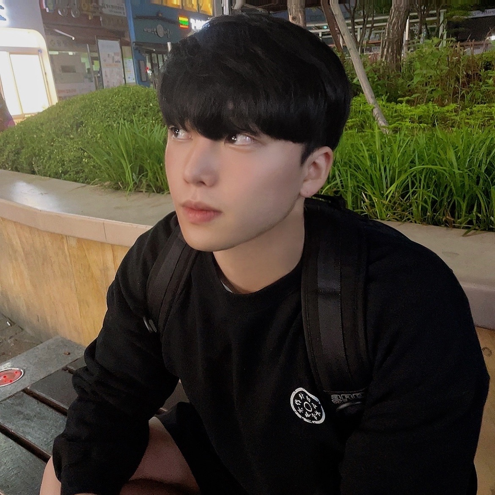

# 🤗 Welcome to Sports-IT Platform!

## 🧑🏻‍💻 Introduce

안녕하세요, 여기는 Sport-iT 플랫폼을 개발하고 관리 및 기록하는 장소입니다!  

---

## 💫 팀원 소개
<table>
<tr>
  <thead>
   <th align="center">김영훈</th>
   <th align="center">공명규</th>
   <th align="center">이준수</th>
   <th align="center">신우현</th>
  </thead>
  <tbody>
    <tr>
      <td align="center">Devops</td>
      <td align="center">Database, Back-End</td>
      <td align="center">Mobile, Back-End</td>
      <td align="center">Front-End</td>
    </tr>
    <tr>
      <td align="center">
        
      </td>
      <td align="center">
        
      </td>
      <td align="center">
        
      </td>
      <td align="center">
        
      </td>
    </tr>
    <tr>
      <td align="center"><a href="https://github.com/dudgns2947">gongzuri</a> </td>
      <td align="center"><a href="https://github.com/MyeongQ">MeongQ</a></td>
      <td align="center"><a href="https://github.com/dlwnstn0524">level_lee</a></td>
      <td align="center"><a href="https://github.com/WooHyunKing">WooHyunKing</a></td>
    </tr>
    <tr>
      <td align="center">
        <ul>
          <li>Sports-iT 교내창업동아리 대표</li>
          <li>(사)대한팔씨름연맹 KAF 미래혁신 위원장</li>
          <li>제 1대 소프트웨어융합대학 학생회 글로벌융합국장</li>
        </ul>
      </td>
      <td align="center">
        <ul>
          <li>육군병장 만기전역</li>
          <li>아주대학교 iKnowLab 인턴 근무 (~2022.01)</li>
        </ul>
      </td>
      <td align="center">
        <ul>
          <li>해군병장 만기전역 ㅋ</li>
          <li>2022 하계방학 이커머스 플랫폼 'FIM ASIA' 인턴 근무</li>
        </ul>
      </td>
      <td align="center">
        <ul>
          <li>육군병장 만기전역</li>
          <li>2022 동계방학 LS ware 인턴 근무</li>
        </ul>
      </td>
    </tr>
  </tbody>
</table>

 

---

## 🛎️개발로그
#### [2023-03-02]()  

## 🎃 회의록
#### [2023-03-02]()  

## 🔥 Goal
추후 업로드 예정입니다.  

---

## 🎸 기타

혹시 저희 스터디를 관리하는 [저장소](https://github.com/LinkedSports/Sports-iT-App/)로 인하여  
문제 발생시 [연락망](dudgns2947@ajou.ac.kr)로 연락 바랍니다.  

---

## 참고

- [디자인 및 기획서](https://github.com/orgs/LinkedSports/people)

- [Figma 사용법](https://slash-amaranthus-65c.notion.site/Figma-c1dead5d929d44498e94641f8058e10d)

- [Git 사용법](https://github.com/code-squad/codesquad-docs/blob/master/codereview/README.md)

---
